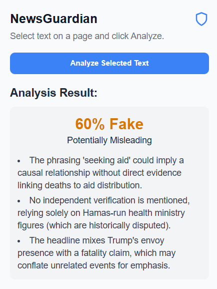

# NewsGuardian - AI-Powered Fake News Detector


<p align="center">
  
</p>

<p align="center">
  
</p>

NewsGuardian is a Chrome browser extension designed to help users critically evaluate online content. By leveraging the power of Large Language Models, this tool provides a rapid credibility analysis of any selected text, helping to combat the spread of misinformation in a real-time browsing environment.

---

## 🚀 About The Project

In today's digital age, distinguishing fact from fiction is more challenging than ever. NewsGuardian was built to empower users with a first-pass analysis of news articles, headlines, or any online text. Simply highlight the text, click the extension icon, and receive an instant breakdown of its potential for being misleading, including a percentage score and a list of reasons for the analysis.

### The Vision: Real-time Fact-Checking with X (Twitter) Data

The ultimate vision for NewsGuardian is to integrate with a model like **xAI's Grok**. The key advantage of Grok is its real-time access to the vast dataset of X (formerly Twitter), which would allow the extension to:
* Check if a breaking news story is being corroborated by multiple trusted sources simultaneously.
* Analyze the public discourse and sentiment around a topic.
* Instantly identify if a claim originates from a known source of misinformation.

Due to API credit limitations on paid, state-of-the-art models, this public version utilizes a powerful free model available through the OpenRouter API. However, the core architecture is built to be model-agnostic, ready to be pointed at a more advanced API like Grok's when feasible.

---

## 🛠️ Tech Stack

* **Frontend:** HTML, CSS, JavaScript
* **Browser API:** Chrome Extension Manifest V3
* **AI Integration:** OpenRouter API
* **Core Logic:** Asynchronous Fetch API, DOM Manipulation

---

## ⚙️ Getting Started

To get a local copy up and running, follow these simple steps.

### Prerequisites

* Google Chrome
* An API key from [OpenRouter.ai](https://openrouter.ai/)

### Installation

1.  **Clone the repo**
   
2.  **Navigate to the project directory**
    ```sh
    cd NewsGuardian-Extension
    ```
3.  **Create your `background.js` file**
    This repository includes a `background.example.js` file. To make the extension work, you must:
    * Make a copy of `background.example.js`.
    * Rename the copy to **`background.js`**.

4.  **Add your API Key**
    Open the new `background.js` file and replace the placeholder text with your actual OpenRouter API key:
    ```javascript
    const OPENROUTER_API_KEY = "YOUR_API_KEY_GOES_HERE";
    ```
5.  **Load the Extension in Chrome**
    * Open Chrome and navigate to `chrome://extensions`.
    * Enable "Developer mode" in the top right corner.
    * Click "Load unpacked".
    * Select the `NewsGuardian-Extension` folder. The NewsGuardian icon should now appear in your toolbar.

---

## Usage

1.  Navigate to any webpage with a news article or text you want to analyze.
2.  Highlight the headline or a paragraph with your mouse.
3.  Click the NewsGuardian shield icon in your Chrome toolbar.
4.  Click the "Analyze Selected Text" button.
5.  View the analysis result directly in the popup!

---

## 📄 License

Distributed under the MIT License. See `LICENSE` for more information.

---

